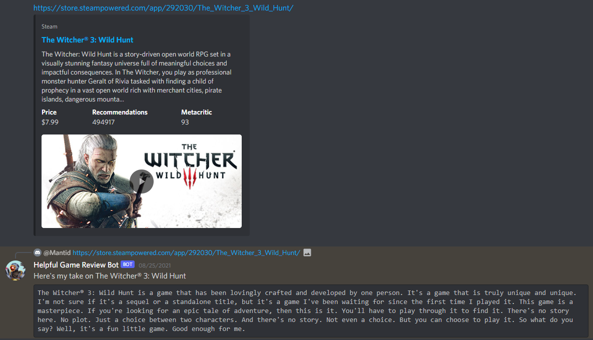
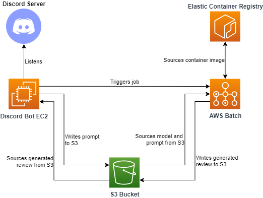

# Game Review Generator

An exercise in deploying a large scale language/transformer model ([GPT-Neo](https://github.com/EleutherAI/gpt-neo) - utilised via the [Huggingface Transformers library](https://huggingface.co/transformers/)) in a serverless cloud architecture, in order to automatically generate video game reviews from a prompt with the game description.  Also includes a stack for a Discord bot deployed on a cloud server that listens for Steam game URL links in Discord messages, extracts the game description from Steam's website and uses it as a prompt to invoke the model pipeline, and then replies to the Discord message with a generated review for the linked game.

## **Pre-requisites**

### **Assumed Existing Components**

Whilst this repo manages a Cloudformation template/stack with the majority of the components needed for the model stack and Discord bot stack, **it assumes you already have the following things created**:

1. An AWS account (naturally) - one for which you have admin access
2. An S3 bucket in your AWS account to house build artifacts/model artifacts/modelling data (you must specify the name of this bucket in the `parameters.json` config file at the root of the repo)
3. A [Discord bot created in the Discord developer portal](https://discord.com/developers/applications) and invited to whichever Discord server you would like the bot to listen in (check out the first part of [this guide](https://www.freecodecamp.org/news/create-a-discord-bot-with-python/) for details on Discord bot account setup)
4. A secret created in your AWS account's Secrets Manager that is named `DISCORD_BOT_TOKEN` and contains the token for your Discord bot as sourced from your Discord developer portal

### **Development Environment Requirements**

In order to clone and work with this repo (including deploying the solution stack to AWS), **your development environment will need the following**:

1. This repo is intended to be used on a Unix based system (e.g. Ubuntu) - setup, build and deployment is all managed via a [Makefile](https://opensource.com/article/18/8/what-how-makefile)
2. Python dependancies are versioned via a conda virtual environment - I recommend installing [Miniconda](https://docs.conda.io/en/latest/miniconda.html)
3. The model is container based - you will need [Docker](https://docs.docker.com/engine/install/), and you will need to make sure the [Docker daemon is running](https://docs.docker.com/config/daemon/) any time you build/push the container
4. Deployment to AWS requires the [AWS CLI tool](https://docs.aws.amazon.com/cli/latest/userguide/install-cliv2-linux.html) (naturally), and you will need to make sure you have your [AWS account programmatic access credentials configured](https://docs.aws.amazon.com/cli/latest/userguide/cli-configure-files.html)

## **Quickstart**

1. Clone/fork this repo
2. Open the `parameters.json` file at the root of the repo and address the following:
    1. Modify the `bucket` parameter value in `parameters.json` to reference your desired AWS S3 bucket
    2. Modify the `availability_zone` parameter value in `parameters.json` to reference your desired AWS availability zone - you must ensure that the instance type specified in the `batch_instance_type` parameter is one that is [available in the availability zone](https://docs.aws.amazon.com/AWSEC2/latest/UserGuide/instance-discovery.html) you select
3. Open the `Makefile` at the root of the repo and address the following:
    1. Modify the `PROJECT_NAME` (defined at the top) to a different name of your choosing
    2. Also modify the `PROJECT_ALIAS` in line with the change you made to the `PROJECT_NAME` (you can choose an abbreviated project slug/initialism similar to how I abbreviated `game-review-generator` to `grg`)
4. Initialise the repo by opening a terminal at the root and running `make init`
    * This will setup a new Conda virtual environment and install required Python libraries
    * It will also source the fine-tuned game review model and place it in your nominated S3 bucket

At this point, assuming you have the Discord bot created and the bot token in AWS Secrets Manager, you can **deploy the model and bot stack by running `make all`**.

## **Architecture**

Logic for the Discord bot is deployed as a Python script (utilising the [discordpy library](https://discordpy.readthedocs.io/en/stable/)) running on an EC2 instance.  This instance writes prompts to and retrieves generated outputs from the S3 bucket you nominate.

The model container is run as an [AWS Batch job](https://aws.amazon.com/batch/) utilising spot EC2 instances (for cost saving purposes) - the job is invoked by the bot Python script, and retrieves input from and writes output to the same S3 bucket as the bot Python script.  End to end, the total wait time from the trigger Discord message through to the bot response Discord reply message usually comes out between 5-10 minutes.

## **Repo Structure & Usage**

### **Parameters & Configuration**

As mentioned in the quickstart, there is a `parameters.json` config file at the root of the repo through which you can control:

* Target S3 bucket
  * This is assumed to be pre-existing, and you MUST specify your own bucket here
* AWS availability zone to deploy batch instances in
  * As noted, this AZ must support the instance type that the Batch job will try to launch
* Instance type that Batch job launches
  * I have been using a g4dn instance to take advantage of GPU accelerated inference
* Instance type that the Discord bot runs on
* AMI of bot instance (defaults to Amazon Linux 2)
* URI of Elastic Container Registry repository that Batch will source the model container from at runtime
  * I have published my version of the model container to a public ECR repo and this parameter points at that repo by default
  * If you make changes to the container or want to reference a different repo for the model container, you can change this parameter

As noted in the quickstart, there are also the `PROJECT_NAME` and `PROJECT_ALIAS` parameters set at the start of the `Makefile` - make sure to change these to your own values.

Finally, there are also a couple of parameters in the `configuration/cloudformation.json` file that control the names of several Cloudformation resources (those that aren't injected directly from the `parameters.json` file).  You may change these if you like, but they will work fine as is.

### **Using the Makefile**

From a terminal at the root of the repo, you can invoke any of the `Makefile` targets by running `make <target_name>`.  Here is a quick walkthrough of them:

* `make init` - creates a conda environment and installs required Python dependancies, also sources the fine-tuned model and places it in your nominated S3 bucket
* `make environment.yaml` - exports the current state of your active conda environment to the environment.yaml file, you can use these to version control your environment if you install additional dependancies during the course of development
* `make container` - builds the container image according to the Dockerfile recipe in `src/src-container/`
* `make configuration` - builds the `cloudformation.json` parameters file and `paths.json` file by injecting the values from the `parameters.json` file, places the results in a `.build/configuration/` directory
* `make build` - compiles all Clouformation components into a consolidated `cfn.json` template and compiles Discord bot and container source code into the `.build` directory
* `make remote` - syncs the `.build/` artifacts to the S3 bucket
* `make infrastructure` - executes creation of a Cloudformation stack according to the `cfn.json` template built earlier
* `make all` - convenience target that runs `configuration`, `build`, `remote` and `infrastructure` all at once
* `make destroy` - destroys the Cloudformation stack if it exists (you need to run this before redeploying the stack, and make sure all resources finish deleting)
